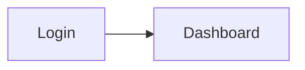

# Como preencher a documentação de um produto

Este guia descreve o formato de conteúdo aceito pelo Playsaurus V2.

## 1. Onde ficam os arquivos

O idioma padrão fica em:

```text
projetos/<id>/docs/
```

Cada seção tem sua própria pasta:

```text
docs/
├── arquitetura/
├── usabilidade/
└── referencia/
```

Use arquivos `.md`. O `index.md` é a página inicial da seção.

## 2. Nome e ordem das páginas

Quando a ordem importar, coloque um número no começo do nome:

```text
usabilidade/
├── index.md
├── 01-primeiros-passos.md
├── 02-login-e-acesso.md
├── 03-dashboard.md
└── 10-configuracoes.md
```

O prefixo controla a ordem, mas não entra na URL. Por exemplo:

```text
02-login-e-acesso.md → /usabilidade/login-e-acesso
```


## 3. Estrutura mínima de um artigo

Na maioria dos casos, basta Markdown normal:

```md
# Login e acesso

Explique em poucas linhas o objetivo da tela.

## Entrar no sistema

1. Abra a página de login.
2. Informe e-mail e senha.
3. Clique em **Entrar**.

## Problemas comuns

Explique erros ou limitações relevantes.
```

O primeiro `# H1` é o título da página. Não repita o mesmo título em frontmatter.

## 4. Frontmatter: só quando acrescentar informação

Não use frontmatter por padrão. Ele é útil apenas para metadata funcional.

### Público da Central de Ajuda

```md
---
publico: admin
---

# Gerenciar usuários
```

Valores usados atualmente:

```text
todos
admin
```

Isso serve para filtragem da Central de Ajuda. Não use como mecanismo de
segurança.

### Categorias administrativas no FAQ

```md
---
faq_admin:
  - Administração
  - Segurança
---

# Perguntas frequentes
```

## 5. Links entre páginas

Prefira links relativos:

```md
Veja também [Primeiros passos](./01-primeiros-passos.md).

Consulte [Permissões](../referencia/02-permissoes.md).
```

Também é possível apontar para uma âncora:

```md
[Ver recuperação de senha](./02-login-e-acesso.md#recuperar-senha)
```

O build valida links internos. Um link para uma seção interna que não entra no
portal cliente é desativado no pacote público.

## 6. Títulos e âncoras

Use `##` e `###` para organizar o artigo:

```md
## Configuração

### Usuários

### Permissões
```

As âncoras são geradas automaticamente. Quando uma âncora precisa ficar estável,
pode ser explícita:

```md
## Recuperar senha {#recuperar-senha}
```

## 7. Imagens

Arquivos estáticos ficam em:

```text
projetos/<id>/static/img/
```

No Markdown:

```md

```

O build incorpora as imagens necessárias no standalone.

Screenshots automáticos normalmente ficam em:

```text
static/img/usabilidade/geradas/
```

## 8. Tabelas

Tabelas Markdown são suportadas normalmente:

```md
| Perfil | Pode editar | Pode visualizar |
|---|---:|---:|
| Admin | Sim | Sim |
| Usuário | Não | Sim |
```

## 9. Blocos de código

Use fences Markdown:

````md
```json
{
  "ativo": true
}
```
````

## 10. Mermaid

Diagramas Mermaid são suportados:

````md

````

Use diagramas quando eles explicarem um fluxo melhor que texto; não transforme
toda página em diagrama.

## 11. Avisos e observações

O Playsaurus entende admonitions simples:

```md
:::info
Informação complementar.
:::

:::warning Atenção
Explique o risco ou cuidado necessário.
:::
```

Tipos suportados:

```text
note
tip
info
warning
caution
danger
```

## 12. O que colocar em cada seção

### Arquitetura

Conteúdo para equipe técnica, por exemplo:

- visão geral do sistema;
- stack e dependências relevantes;
- autenticação e autorização;
- banco de dados;
- integrações;
- fluxos técnicos;
- decisões importantes;
- segurança e operação.

Se Arquitetura estiver marcada como não publicável no painel, ela continua no
build interno e desaparece do portal cliente.

### Usabilidade

Conteúdo orientado à tarefa do usuário:

- primeiros passos;
- login e acesso;
- navegação;
- telas e recursos principais;
- passo a passo;
- mensagens de erro comuns;
- solução de problemas.

Prefira explicar **o que a pessoa quer fazer**, não reproduzir a estrutura do
código.

### Referência

Conteúdo de consulta rápida:

- glossário;
- permissões;
- regras do produto;
- perguntas frequentes;
- limites e comportamentos importantes.

## 13. Formato do FAQ

O Playsaurus reconhece automaticamente uma página chamada
`perguntas-frequentes.md`.

Use `##` para categorias e `###` para perguntas:

```md
# Perguntas frequentes

## Geral

### Como faço login?

Abra a tela de login, informe suas credenciais e clique em **Entrar**.

## Administração

### Como removo um usuário?

Abra a administração de usuários e escolha a ação de remoção.
```

Se uma categoria inteira for apenas administrativa, liste seu título em
`faq_admin` no frontmatter.

## 14. Traduções

O idioma padrão fica em `docs/`. Traduções repetem exatamente a mesma árvore:

```text
docs/usabilidade/02-login.md
i18n/en/usabilidade/02-login.md
i18n/es/usabilidade/02-login.md
```

Crie scaffolds com:

```bash
npm run i18n:init -- <id>
```

Depois traduza os arquivos e remova o marcador:

```text
PLAYSAURUS_TRANSLATION_PENDING
```

Valide com:

```bash
npm run i18n:check -- <id>
```

Preserve links, caminhos de imagens, anchors explícitas e metadata funcional.

## 15. Verificar enquanto escreve

Pelo painel, use **Gerar build** e **Visualizar**.

Pelo terminal:

```bash
npm run build -- <id>
npm run serve -- <id>
```

Antes de publicar, confira pelo menos:

- navegação;
- links internos;
- imagens;
- tema claro/escuro;
- versão cliente;
- PDFs quando aplicável;
- traduções configuradas.

## 16. Publicação

A documentação fonte nunca é copiada para o produto. A publicação usa somente:

```text
projetos/<id>/output/cliente/
```

Para publicar:

```bash
npm run publish -- <id>
```

## 17. Regra de ouro

Uma boa página responde rapidamente:

1. **Para que serve?**
2. **Como usar?**
3. **O que pode dar errado?**
4. **Onde encontro mais informação?**

Se a página não ajuda alguém a executar ou entender algo, provavelmente ela pode
ser menor.

# Preencher com ajuda de IA

Os prompts abaixo são modelos. Dê sempre acesso ao código e aos documentos reais
que a IA precisa analisar; não peça para inventar comportamento ausente.

## Prompt 1 — mapear o produto

```text
Analise o projeto antes de escrever documentação.

Quero um inventário factual de:
- telas e rotas;
- perfis/permissões;
- fluxos principais;
- integrações;
- entidades e regras importantes;
- erros e estados vazios relevantes.

Não escreva a documentação final ainda. Aponte também o que não pôde ser
confirmado pelo código.
```

## Prompt 2 — Arquitetura

```text
Usando apenas o que foi confirmado no projeto, escreva a documentação técnica em
Markdown para a seção Arquitetura.

Priorize visão geral, componentes, autenticação/autorização, dados, integrações,
fluxos importantes e decisões técnicas. Use Mermaid somente quando esclarecer o
fluxo. Não invente infraestrutura ou comportamento que não esteja no projeto.
```

## Prompt 3 — Usabilidade

```text
Escreva a documentação de Usabilidade em Markdown, organizada pelas tarefas reais
do usuário.

Para cada tarefa, explique objetivo, pré-requisitos quando existirem, passo a
passo, resultado esperado e problemas comuns. Use linguagem de produto, não de
implementação. Inclua referências a screenshots quando elas realmente ajudarem.
```

## Prompt 4 — Referência e FAQ

```text
Crie a seção Referência em Markdown com somente informações confirmadas no
produto: glossário, perfis/permissões, regras e perguntas frequentes.

Na página perguntas-frequentes.md, use ## para categorias e ### para perguntas.
Use publico/faq_admin apenas quando houver diferença real entre usuários comuns e
administradores.
```

## Prompt 5 — atualizar após uma mudança

```text
Compare a implementação atual com a documentação existente.

Altere somente as páginas afetadas pela funcionalidade nova ou modificada.
Preserve nomes de arquivo, links e estrutura quando ainda forem válidos. Remova
instruções que ficaram falsas e acrescente apenas comportamento confirmado no
código atual.
```
